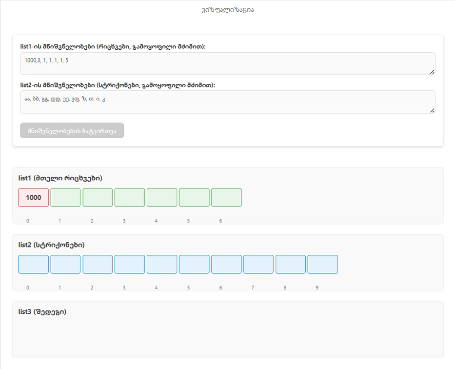

# List Processing Program

## Description
This Java program performs a two-phase list processing operation that combines and filters elements from two input lists (`list1` and `list2`) to produce an output list (`list3`).

### Key Features:
- Combines elements from `list1` (integers) and `list2` (strings) using specific indexing rules
- Filters the combined list by removing elements at positions specified by values from `list1`
- Includes robust error handling for out-of-bounds indices
- Demonstrates proper list manipulation techniques

## Algorithm Overview
1. **Initialization Phase**:
   - Creates `list1` with predefined integer values
   - Creates `list2` with predefined string values

2. **Combination Phase**:
   - For each value in `list1`, uses it as an offset (+1) to index into `list2`
   - Combines matching elements in the format "[list2Element][list1Value]"
   - Example: If `list1` value is 3 and corresponding `list2` element is "coq", creates "coq3"

3. **Filtering Phase**:
   - Removes elements from the combined list where:
     - The original `list1` value corresponds to a valid index in `list3`
     - Removal is performed from highest to lowest index to prevent position shifting

## Error Handling
The program includes comprehensive error handling for cases where:
- A value in `list1` would cause an out-of-bounds access in `list2`
- A value in `list1` would be an invalid index for `list3`

### Error Handling Example:
When a value in `list1` is too large to be a valid index in `list2`, the program:
1. Catches the `IndexOutOfBoundsException`
2. Logs a descriptive error message
3. Continues processing with the next element

  
*(Note: Replace with actual screenshot from test page showing out-of-bounds error handling)*

## Program Output
The program prints:
1. Initial contents of `list1` and `list2`
2. Intermediate `list3` after combination phase
3. Final `list3` after filtering phase
4. Any error messages for skipped elements

## Usage
1. Compile: `javac oop/final/t1/Task1.java`
2. Run: `java oop.final.t1.Task1`

## Dependencies
- Java SE 8 or higher

## Implementation Notes
- Uses `ArrayList` for dynamic list operations
- Employs `HashSet` to track unique indexes for removal
- Sorts removal indexes in descending order to maintain list integrity during removal
- Package name: `oop.final.t1` as specified

## Example Output
