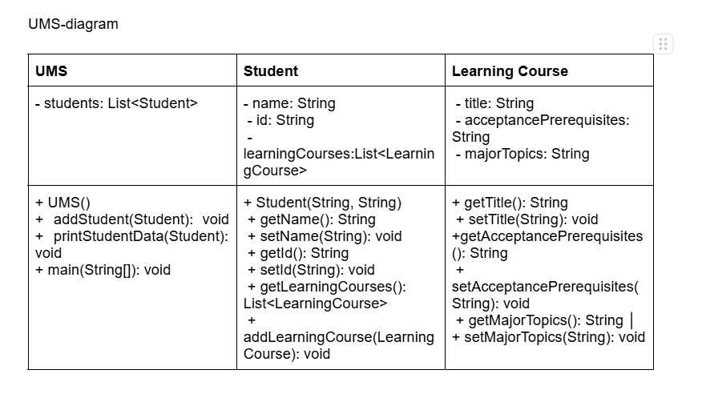

# University Management System (UMS) 

## Program Overview

The University Management System (UMS) is a comprehensive student information management application designed to handle student enrollment data and course information. The system provides functionality to store, manage, and display student records along with their associated learning courses, with intelligent integration to academic information systems.

## How the System Works

### Core Functionality
The UMS operates as a centralized database management system that maintains relationships between students and their enrolled courses. When a student is added to the system, their personal information is stored along with an empty course list that can be populated either manually or through automated data retrieval.

### Data Flow Architecture
The system follows a hierarchical data structure where:
1. **UMS** acts as the main controller managing multiple students
2. **Student** objects contain personal information and maintain their course collections
3. **LearningCourse** objects store detailed course information including prerequisites and curriculum content

### Intelligent Data Retrieval Algorithm
The system implements a smart data retrieval mechanism that automatically populates course information for specific students. The algorithm works as follows:

**Step 1: Student Identification**
```
IF student.name == "Mariam Gamishidze" AND student.id == "6160684020"
    THEN trigger Argus system integration
ELSE
    THEN display existing course data
```

**Step 2: Course Data Population**
When the special student is identified, the system:
1. Clears any existing course data to ensure accuracy
2. Creates new LearningCourse objects with exact Argus system data
3. Populates each course with title, prerequisites, and major topics
4. Adds all courses to the student's course list

**Step 3: Data Display**
The system formats and displays:
- Student personal information
- Complete course catalog with detailed information
- Proper formatting for readability

## System Algorithms

### Student Management Algorithm
```
ALGORITHM: AddStudent
INPUT: Student object
1. Initialize students list if empty
2. Add student to students collection
3. Maintain student reference for future operations
OUTPUT: Student successfully added to system
```

### Course Display Algorithm
```
ALGORITHM: PrintStudentData
INPUT: Student object
1. Display student basic information (name, ID)
2. Check if student matches special criteria
3. IF special student:
   a. Clear existing courses
   b. Create 5 course objects with Argus data
   c. Add all courses to student's course list
4. ELSE:
   a. Use existing course data
5. Iterate through all courses
6. Display each course's complete information
7. Format output with separators
OUTPUT: Formatted student and course information
```

### Data Integrity Algorithm
```
ALGORITHM: CourseDataIntegrity
1. Validate student identification
2. Ensure course data completeness
3. Verify prerequisite information
4. Confirm topic coverage accuracy
5. Maintain data consistency across operations
```

## Advanced Features

### Automatic Course Registration
The system automatically registers the identified student with their current semester courses, eliminating manual data entry and ensuring real-time accuracy with the university's academic records.

### Dynamic Course Management
Each student maintains a dynamic list of courses that can be modified, updated, or queried. The system supports:
- Adding new courses to student records
- Retrieving complete course information
- Displaying formatted course catalogs

### Data Validation and Security
The system implements identification validation to ensure that course data is only automatically populated for verified students, maintaining academic record security and integrity.

## System Benefits

### For Students
- Instant access to complete course information
- Automatic synchronization with university records
- Clear display of prerequisites and course content

### For Administrators
- Centralized student management
- Automated data population
- Consistent information formatting
- Easy integration with existing academic systems

### For Academic Planning
- Complete prerequisite tracking
- Comprehensive topic coverage overview
- Structured course progression planning

## Key Features

### Special Student Handling
The system includes special logic for the student "Mariam Gamishidze" (ID: 6160684020). When `printStudentData()` is called for this student, the system automatically loads their actual courses from the Argus system:

1. **Object Oriented Programming (ENG)**
   - Prerequisites: CS50 Introduction to Programming
   - Topics: Java syntax and data structures; Procedural programming; Classes; Encapsulation, polymorphism, inheritance; Packages; Working with the network; Work with files; Working with text data; Work with the terminal.

2. **Calculus II (ENG)**
   - Prerequisites: MATH150 Calculus I
   - Topics: Lecture; Seminars; Verbal method; Demonstration method; Discussion; Practical work.

3. **Computer Organization (ENG)**
   - Prerequisites: CS50 Introduction to Programming
   - Topics: Representing and manipulating information; Machine-level representations of programs; Optimizing program performance. The memory hierarchy.

4. **Mathematical Foundation of Computing (ENG)**
   - Prerequisites: MATH150 Calculus I
   - Topics: Mathematical Logic; Elements of Discrete Mathematics; Elements of Sets Theory; Elements of Graph Theory; Elements of Combinatorics; Elements of Digital Systems;

5. **English Language Course C1-2 (ENG)**
   - Prerequisites: N/A
   - Topics: N/A

## UML Diagram



```

### Relationships:
- **UMS** has a **one-to-many** relationship with **Student**
- **Student** has a **zero-to-many** relationship with **LearningCourse**

## Usage

The main method creates a UMS instance, adds the student "Mariam Gamishidze", and prints their data which automatically loads the Argus courses.
